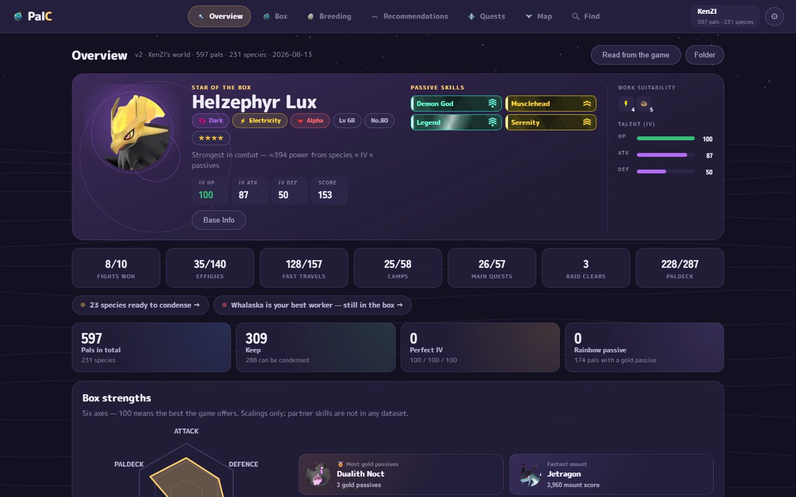
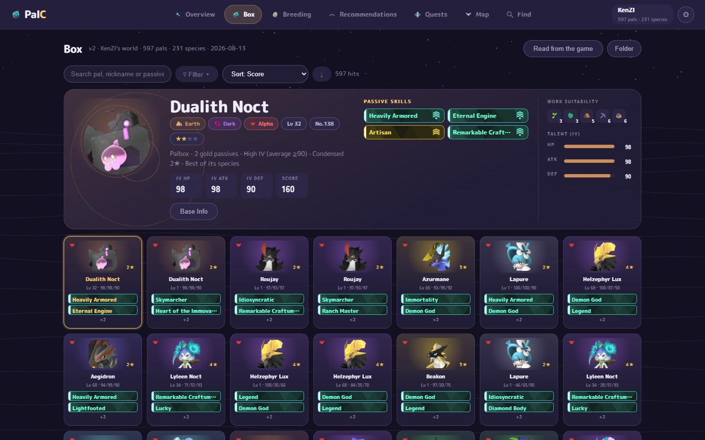
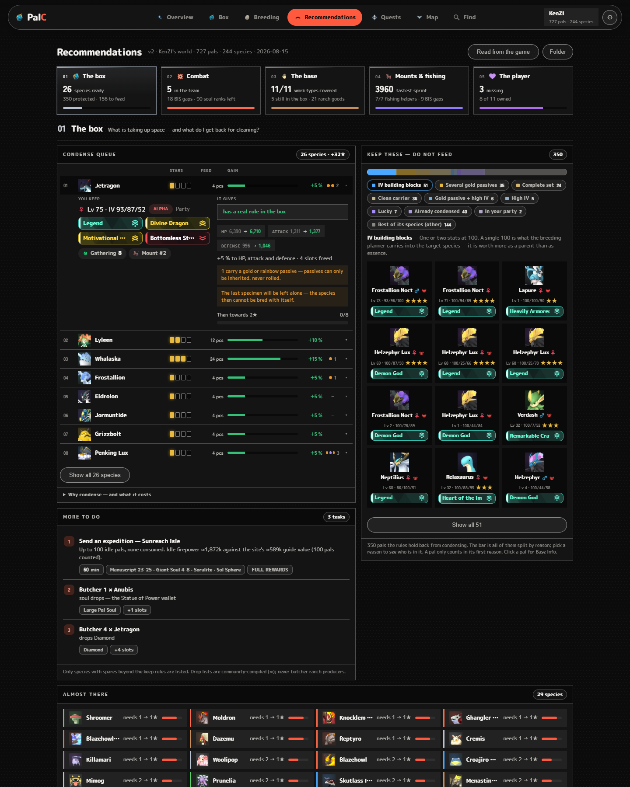
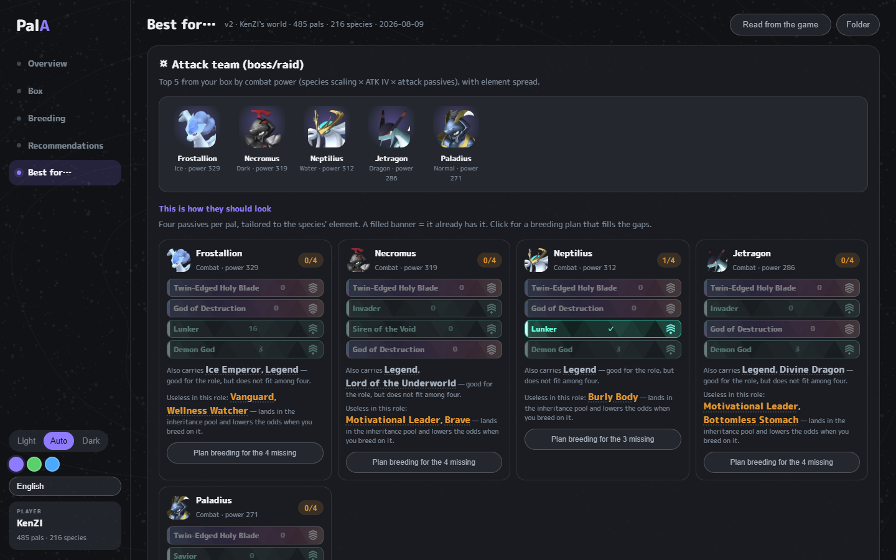
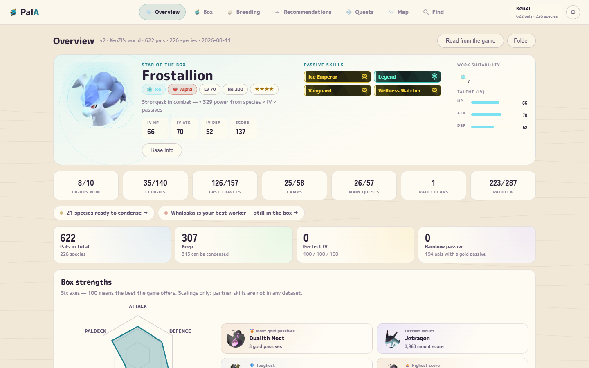

# PalAssistent

**A box manager and breeding planner for Palworld.** It reads your own save file and answers the
questions that otherwise cost you hours in front of the breeding pen: which pals should I keep,
which ones can be condensed, and how do I actually breed that Anubis with Legend, Ferocious, Swift
and Musclehead?

Everything runs locally on your machine. The save file is opened read-only and nothing is ever
uploaded anywhere.

> **Note:** the app's interface is currently in Swedish. An English translation is planned — see
> [issues](../../issues) if you'd like to help.



## Download

### ▶ [Get PalAssistent](../../releases/latest/download/PalAssistent-Setup.exe)

Windows 10/11 · about 60 MB · free

Run the installer, start PalAssistent from the Start menu, and click **Läs in från spelet** ("read
from the game"). That's it. You don't need Node, Python or anything else — it's all in the package.

> The first time, Windows may show *"Windows protected your PC"*. That's because the installer
> isn't code-signed — a certificate costs hundreds of dollars a year — not because anything is
> wrong. Click **More info** → **Run anyway**.

## What it does

### The breeding planner

This is why the app exists. Pick a target species, what the pal is for, and up to four passive
skills you want. You get back a **complete plan**: which pals in your box carry which passive and
where they are stored, what order to breed them in, and the **odds per egg** for every step.


The plan is measured in **expected number of eggs, not number of steps** — and that is the whole
point. A four-step chain with clean parents is almost always cheaper than a three-step shortcut
where one parent carries four junk passives, because every extra passive lands in the inheritance
pool and dilutes your chances. In a real box the difference is 60–450×. You cannot eyeball that.

Switch the IV goal to **perfect 100/100/100** and it searches for the shortest path there across
multiple generations, accounting for the fact that gender costs (a chick is a 50/50) and that
siblings from the same clutch share eggs.

### The box

Your whole box as tiles with level, IVs and passives. Search, filter and sort — or open the game's
own Base Info view for the selected pal, with condense stars, status bars and the work suitability
strip.



### Recommendations

What to condense **now**, ranked by biggest gain: the star jump you get, how many duplicates it
consumes, how many box slots it frees — and what the one you keep is actually good at, so you
don't feed away your best miner by accident.



### Best for…

Attack team, base dream team, best workers per work type (both from your own box and globally),
fishing pals and fastest mounts. Click a species you don't own and you land straight in a breeding
plan for it.



### Live mode

Tick **Live** under **Mapp** ("folder") and the app watches for the game saving, refreshing your
box on its own. Catch a pal, alt-tab, and it's already in the list. Between checks it only looks at
the save file's timestamp, so it costs practically nothing until something actually happens.

If your save lives somewhere other than the game's own folder — a dedicated server, a cloud-synced
folder, a copy — point the app at that folder under **Mapp**.

### Light and dark, three palettes



## Is it safe?

- **The save file is always opened read-only.** The app never writes into the game's folder, so
  Palworld can keep running while you read.
- **Nothing leaves your machine.** The server listens on `127.0.0.1` only — nobody else on your
  network can reach it. The one time the app touches the network is its daily check for a new
  version.
- **The source is right here.** If you'd rather build it yourself, see *Development* below.

## Updates

The app tells you in a bar at the top when a newer version exists. One click downloads and installs
it — the checksum is verified against the release before anything is run. You can also just
download the installer again.

Your imported box is reset by an update, because species data and the breeding table may have
changed. One click on **Läs in från spelet** brings it back, or Live mode does it for you.

## FAQ

**It can't find my save.** Click **Mapp** and point it at the folder. Both a folder (it searches
four levels down) and a `Level.sav` directly will work, and quotes from Explorer's "Copy as path"
are stripped automatically.

**Does it work with a dedicated server?** Yes — point it at the server's save folder under **Mapp**.

**Some pals are missing.** Species added by Palworld after the latest release aren't in the species
list yet; they're reported as skipped after importing. Open an issue and the list gets updated.

**Are the odds exact?** No, and the app says so. The inheritance model is the community-tested one,
without mutations, and so is IV inheritance. They're good enough for what they're used for:
comparing two plans against each other.

**How do I quit?** Close the window. The server closes with it.

## Support the project

PalAssistent is free and will stay that way. If it has saved you a few hours, feel free to buy me a
coffee — the link is at the bottom of the left-hand column in the app.

## Development

```bash
npm install
npm run dev        # http://localhost:3000
```

```bash
npm run build      # production build
npm run typecheck  # tsc --noEmit, strict
npm test           # node:test over src/lib
npm run lint
npm run package    # -> dist/PalAssistent-Setup.exe
```

Run `npm test` after every change in `src/lib`. A miscalculated probability looks exactly as
plausible as a correct one, and neither the build, typecheck nor lint will catch it.

Your own box never ends up in git: `public/data/pal-data.json` is ignored and generated from
`data/pal-data.base.json`, which holds only the static half (species, breeding table, passives).

For **reading the save** in development you need Python (`pip install -r tools/requirements.txt`).
The installed app doesn't need it — there the reader is a bundled `palsave.exe`.

Building the installer additionally requires `pip install pyinstaller` and
[Inno Setup](https://jrsoftware.org/isdl.php).

Releases are automatic: write your notes under **Unreleased** in [CHANGELOG.md](CHANGELOG.md) as
you work, and every Sunday a workflow releases them — but only if there is something to release and
only if the packaged installer actually installs and starts. You can also release on demand from
the Actions tab, or by hand with `npm version minor && git push --follow-tags`.

Architecture, design rules and every hard-won pitfall live in [CLAUDE.md](CLAUDE.md) (in Swedish).
User guide: [docs/USAGE.md](docs/USAGE.md).

## License and bundled content

The source code is [MIT](LICENSE). The package also contains icons, artwork and names from
Palworld, which belong to **Pocketpair, Inc.** — they're included so the tool can show the game's
own symbols for your own save data. This project is not affiliated with or endorsed by Pocketpair.

Save parsing builds on [palworld-save-tools](https://github.com/cheahjs/palworld-save-tools) and
[zao/ooz](https://github.com/zao/ooz); species and breeding data derive from
[palworld-save-pal](https://github.com/oMaN-Rod/palworld-save-pal). See [LICENSE](LICENSE) for the
full list.
