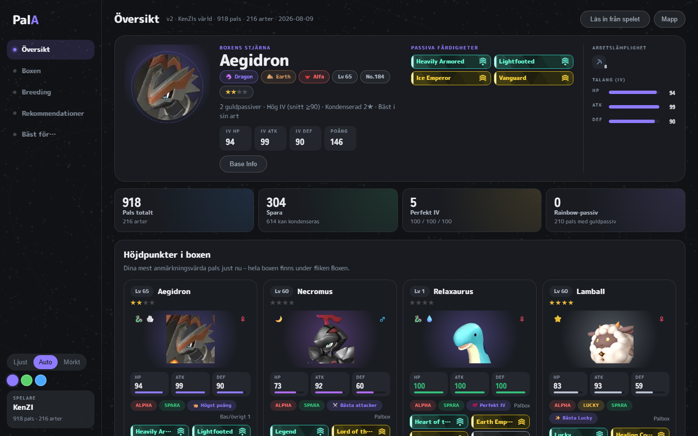
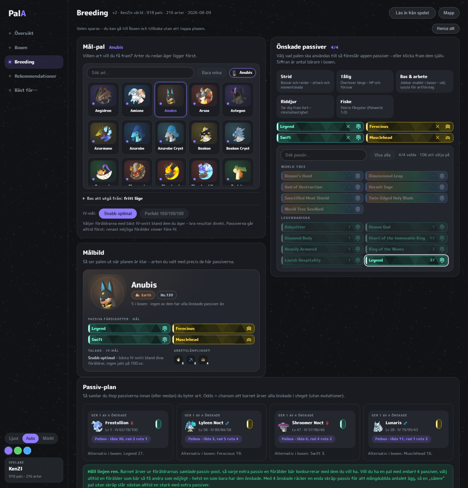
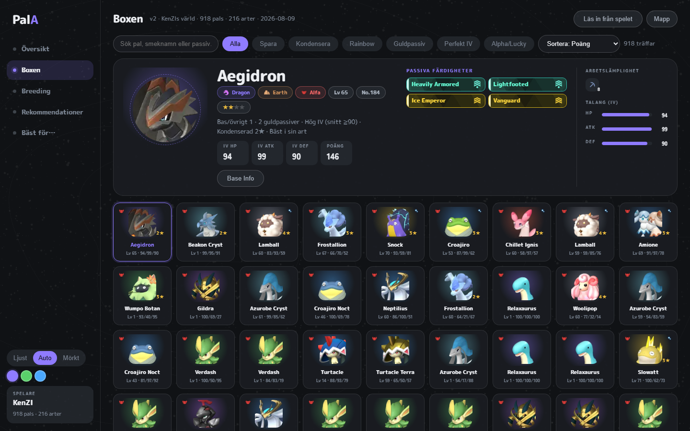
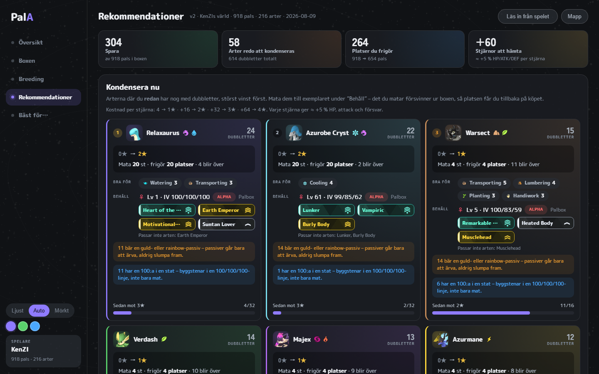
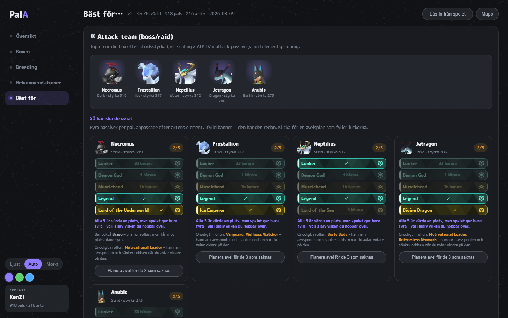
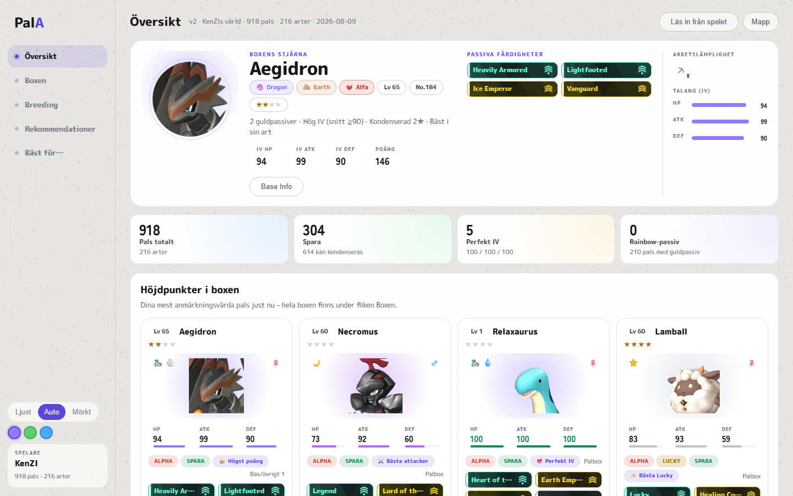

# PalAssistent

**Box- och avelsplanerare för Palworld.** Läser din egen sparfil och svarar på frågorna som
annars kostar timmar framför avelsburen: vilka pals ska jag spara, vilka kan kondenseras, och hur
avlar jag faktiskt fram den där Anubis med Legend, Ferocious, Swift och Musclehead?

Allt körs lokalt på din dator. Sparfilen öppnas skrivskyddat och ingenting skickas någonstans.



## Ladda ner

### ▶ [Hämta PalAssistent](../../releases/latest/download/PalAssistent-Setup.exe)

Windows 10/11 · ca 60 MB · gratis

Kör installationsfilen och starta PalAssistent från Startmenyn. Klicka **Läs in från spelet** –
klart. Du behöver inte installera Node, Python eller något annat; allt ligger i paketet.

> Första gången kan Windows visa *"Windows skyddade din dator"*. Det beror på att filen inte är
> köpsignerad – ett certifikat kostar tusentals kronor om året – inte på att något är fel.
> Klicka **Mer info** → **Kör ändå**.

## Vad den gör

### Avelsplaneraren

Det här är anledningen till att appen finns. Välj målart, vad palen ska användas till och upp till
fyra önskade passiver. Du får tillbaka en **komplett plan**: vilka pals i din box som bär vilken
passiv och var de står, i vilken ordning de ska paras, och **oddsen per ägg** för varje steg.



Planen räknas i **förväntat antal ägg**, inte i antal steg – och det är hela poängen. En kedja på
fyra steg med rena föräldrar är nästan alltid billigare än en genväg på tre där en förälder bär
fyra skräp-passiver, eftersom varje extra passiv hamnar i arvspoolen och späder ut chansen. I en
riktig box är skillnaden 60–450 gånger. Det går inte att se på ögonmått.

Väljer du **Perfekt 100/100/100** söker den dessutom kortaste vägen dit över flera generationer,
och räknar med att kön kostar (en unge är 50/50) och att syskon ur samma kull delar ägg.

### Boxen

Hela boxen som brickor med level, IV och passiver. Sök, filtrera och sortera – eller öppna spelets
egen **Base Info**-vy för den valda palen, med stjärnor, statusstaplar och arbetsremsa.



### Rekommendationer

Vad du bör kondensera **nu**, rankat på störst vinst: stjärnhoppet du får, hur många exemplar som
går åt, hur många boxplatser det frigör – och vad exemplaret du behåller faktiskt är bra för, så du
inte matar bort din bästa gruvarbetare av misstag.



### Bäst för…

Attackteam, basteam, bästa arbetare per syssla (både bland dina egna och globalt), fiskepals och
snabbaste riddjur. Klickar du på en art du inte äger hamnar du direkt i en avelsplan för den.



### Live-läget

Kryssa i **Live** under **Mapp** så håller appen koll på när spelet sparar och uppdaterar boxen av
sig själv. Fånga en pal, alt-tabba, och den finns redan i listan. Mellan varven kollas bara
sparfilens tidsstämpel, så det kostar i princip ingenting förrän något faktiskt hänt.

Ligger saven någon annanstans än i spelets egen mapp – en dedikerad server, en molnsynkad mapp
eller en kopia – pekar du ut mappen under **Mapp**.

### Ljust och mörkt, tre paletter



## Är det säkert?

- **Sparfilen öppnas alltid skrivskyddat.** Appen skriver aldrig in i spelets mapp, så Palworld
  kan ligga kvar och köra medan du läser in.
- **Ingenting lämnar datorn.** Servern lyssnar bara på `127.0.0.1` – ingen annan i nätverket kan
  nå den. Den enda gången appen rör nätet är den dagliga koll om det finns en ny version.
- **Källkoden ligger här.** Vill du hellre bygga den själv står det under *Utveckling* nedan.

## Uppdateringar

Appen säger till i en rad överst när det finns en nyare version. Ett klick hämtar och installerar
den – kontrollsumman verifieras mot utgåvan innan något körs. Du kan också bara ladda ner
installationsfilen igen.

Din inlästa box nollställs vid en uppdatering, eftersom artdata och avelstabell kan ha ändrats.
Ett klick på **Läs in från spelet** hämtar tillbaka den, eller så gör Live det åt dig.

## Vanliga frågor

**Hittar den inte min save?** Klicka **Mapp** och peka ut var den ligger. Både en mapp (den letar
fyra nivåer neråt) och en `Level.sav` direkt fungerar, och citattecken från Explorers "Kopiera som
sökväg" skalas bort automatiskt.

**Fungerar det med dedikerad server?** Ja – peka ut serverns save-mapp under **Mapp**.

**Vissa pals saknas.** Nya arter som Palworld lagt till efter senaste utgåvan hoppas över och
rapporteras vid inläsningen. Säg till i ett issue så uppdateras artlistan.

**Stämmer oddsen exakt?** Nej, och det står i appen. Ärvningsmodellen är den communityn testat
fram, utan mutationer, och IV-arvet likaså. De är bra nog för att jämföra två planer mot varandra,
vilket är vad de används till.

**Hur stänger jag av programmet?** Stäng fönstret. Servern stängs med det.

## Stöd projektet

PalAssistent är gratis och förblir det. Har det sparat dig några timmar får du gärna bjuda på en
kaffe – länken finns längst ner i vänsterspalten i appen.

## Utveckling

```bash
npm install
npm run dev        # http://localhost:3000
```

```bash
npm run build      # produktionsbygge
npm run typecheck  # tsc --noEmit, strict
npm test           # node:test över src/lib
npm run lint
npm run package    # -> dist/PalAssistent-Setup.exe
```

Kör `npm test` efter varje ändring i `src/lib`. En felräknad sannolikhet ser precis lika trovärdig
ut som en riktig, och varken bygget, typecheck eller lint fångar den.

Din egen box hamnar aldrig i git: `public/data/pal-data.json` är ignorerad och skapas ur
`data/pal-data.base.json`, som bara innehåller den statiska halvan (arter, avelstabell, passiver).

För **Läs in från spelet** i utvecklingsläge behövs Python (`pip install -r tools/requirements.txt`).
I den installerade appen behövs det inte – där är läsaren en medföljande `palsave.exe`.

Att bygga installern kräver dessutom `pip install pyinstaller` och
[Inno Setup](https://jrsoftware.org/isdl.php). Utgåvor byggs annars av GitHub Actions när en tagg
pushas (`npm version minor && git push --follow-tags`).

Arkitektur, designregler och alla inlärda fallgropar finns i [CLAUDE.md](CLAUDE.md).
Djupare användarguide: [docs/ANVANDNING.md](docs/ANVANDNING.md).

## Licens och innehåll

Källkoden är [MIT](LICENSE). Paketet innehåller dessutom ikoner, artbilder och namn ur Palworld,
som tillhör **Pocketpair, Inc.** – de följer med för att verktyget ska kunna visa spelets egna
symboler för din egen sparfil. Projektet är inte knutet till eller godkänt av Pocketpair.

Sparfilstolkningen bygger på [palworld-save-tools](https://github.com/cheahjs/palworld-save-tools)
och [zao/ooz](https://github.com/zao/ooz); art- och avelsdata härrör från
[palworld-save-pal](https://github.com/oMaN-Rod/palworld-save-pal). Se [LICENSE](LICENSE) för hela
listan.
